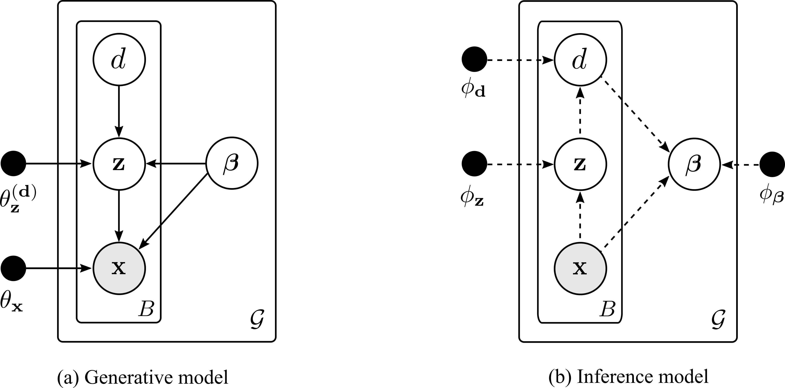

# UG-VAE
This repository contains the official implementation of the Unsupervised Global VAE (**UG-VAE**) model proposed in the 
paper [Unsupervised Learning of Global Factors in Deep Generative Models](). UG-VAE  learns both local and global 
disentanglement from random batches of data in a fully unsupervised manner, which leads to  a promising performance in 
domain alignment and discovering non-trivial underlying structures.

<br>
<p align="center">

</p>
<br>

## Dependencies
```
torch 1.7.0
torchvision 0.8.1
matplotlib 3.3.3
numpy 1.19.4
pandas 1.1.4
scikit-learn 0.23.2
```

## Graphical model
<br>
<p align="center">

</p>
<br>

## Usage


