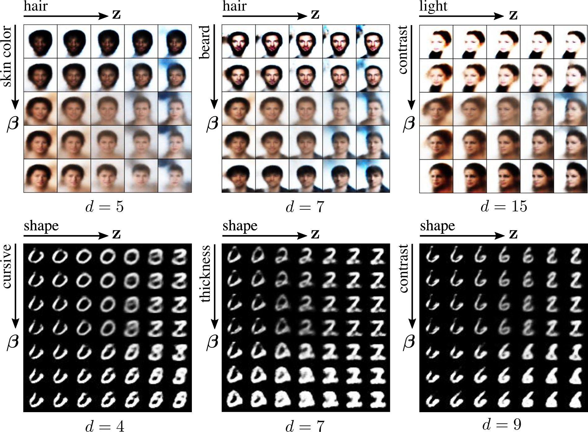
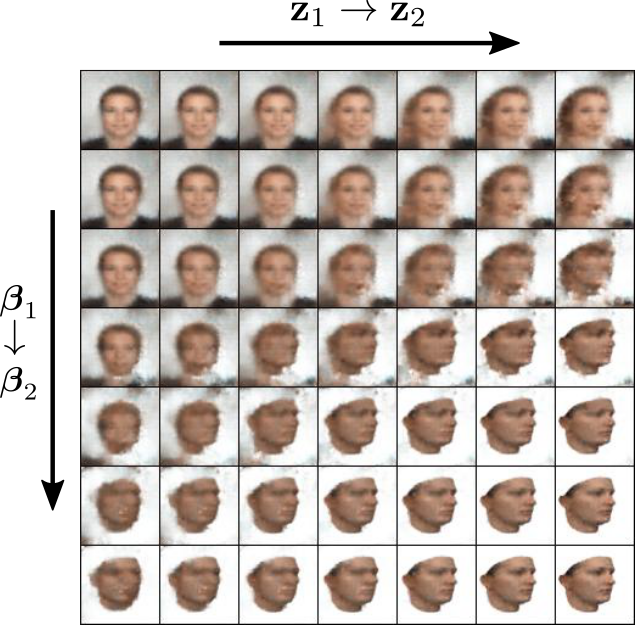
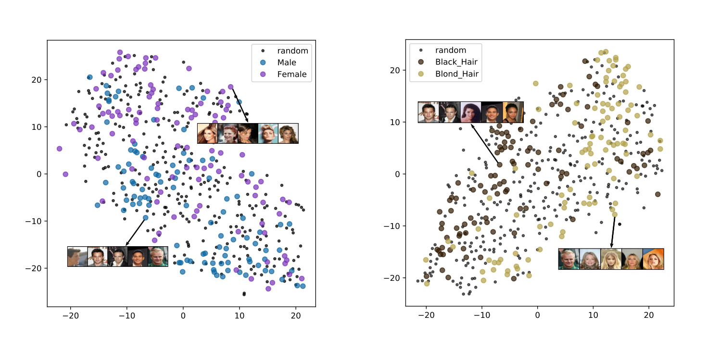
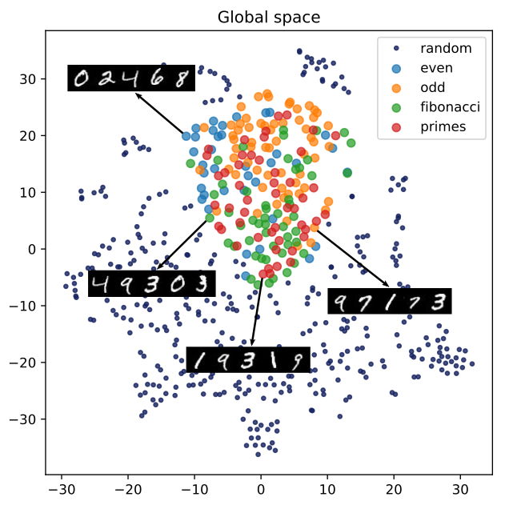

# UG-VAE
This repository contains the official Pytorch implementation of the Unsupervised Global VAE (**UG-VAE**) model proposed in the 
paper 
<a href="https://arxiv.org/abs/2012.08234" target="_blank">Unsupervised Learning of Global Factors in Deep Generative Models</a>

Please, if you use this code, cite the <a href="https://arxiv.org/abs/2012.08234" target="_blank">preprint</a>
 using:
```
@article{UGVAE_PeisOlmosArtes,
  title = {Unsupervised Learning of Global Factors in Deep Generative Models},
  author = {Peis, Ignacio and Olmos, Pablo M and Art\'es-Rodr\'iguez, Antonio},
  journal = {arXiv preprint arXiv:2012.08234},
  year = {2020}
}
```

### Dependencies
```
torch 1.7.0
torchvision 0.8.1
matplotlib 3.3.3
numpy 1.19.4
pandas 1.1.4
scikit-learn 0.23.2
```

## Usage
UGVAE is implemented as a class that inherits from Pytorch <code>nn.Module</code> in <code>models.py</code>. You can train UGVAE using the <code>train.py</code> script. A few examples are included
below:
```
# example for training celeba:
python3 train.py --dataset celeba --arch beta_vae --epochs 10 --model_name celeba 

# example for training mnist
python3 train.py --dataset mnist --arch k_vae --dim_z 10 --dim_beta 20 --K 10 --model_name mnist

# example for training mixed celeba+faces
python3 train.py --dataset celeba_faces --arch beta_vae --dim_z 40 --dim_beta 40 --K 40 --model_name celeba_faces
```
This will create a log dir in <code>results/[model_name]</code>. In <code>/checkpoints/</code>, model checkpoints for 
each log interval are stored. In <code>/figs/</code> you will have reconstruction and samples at the end of each 
log interval, and a plot with the losses of the training procedure. Some remarkable arguments are:
- <code>--dataset</code>: you can choose among <code>celeba</code>, <code>mnist</code>, <code>celeba_faces</code>, 
  <code>cars_chairs</code> and some others included in <code>datasets.py</code>.
  For [CelebA](http://mmlab.ie.cuhk.edu.hk/projects/CelebA.html), 
  [3D FACES](https://faces.dmi.unibas.ch/bfm/index.php?nav=1-1-1&id=scans),
  [Cars dataset](https://ai.stanford.edu/~jkrause/cars/car_dataset.html),
  and [Chairs](https://www.di.ens.fr/willow/research/seeing3Dchairs/)
  you have to download from the given links and put the images in <code>data/[dataset]/img/</code>
- <code>--arch</code>: The architecture for encoder and decoder networks: use <code>beta_vae</code> for convolutional
  networks that work with 64x64 images (as CelebA), or <code>k_vae</code> for fully-connected networks that work with 
  28x28 images (as MNIST). 
- <code>--model_name</code> will be the name of the logdir stored in <code>results/</code> folder.
- <code>--no_cuda</code> for disabling GPU training.

## Examples
UG-VAE  learns both local and global disentanglement from random batches of data in a fully unsupervised manner, which leads to  a promising performance in 
domain alignment and discovering non-trivial underlying structures. Some experiments are included in <code>exps/</code> dir.
### Interpolation
 In <code>experiments/interpolation.py</code> you have an implementation of the Experiment 4.1 of the <a href="https://arxiv.org/abs/2012.08234" target="_blank">paper</a>. By running:
```
python3 interpolation.py --dataset celeba --arch beta_vae --epochs 10 --model_name celeba 
```
you will store in <code>results/[model_name]/figs/interpolation/</code>) figures like the following:

<br>
<p align="center">

</p>
<br>

### Domain alignment
In <code>experiments/domain_alignment.py</code> you have an implementation of experiment 4.2 of the <a href="https://arxiv.org/abs/2012.08234" target="_blank">paper</a>. By running:
```
python3 interpolation.py --dataset celeba --arch beta_vae --epochs 10 --model_name celeba 
```
you will store in <code>results/[model_name]/figs/interpolation/</code>) a similar figure than the following:

<br>
<p align="center">

</p>
<br>

### Global structure
In <code>experiments/celeba_attributes.py</code> and <code>experiments/mnist_series.py</code> you have an implementation
of experiment 4.3 of the <a href="https://arxiv.org/abs/2012.08234" target="_blank">paper</a>. By running:
```
python3 celeba_attributes.py
```
you will obtain figures like the following:
<br>
<p align="center">

</p>
<br>

If you run:
```
python3 mnist_series.py
```
you will obtain figures like the following:
<br>
<p align="center">

</p>
<br>


